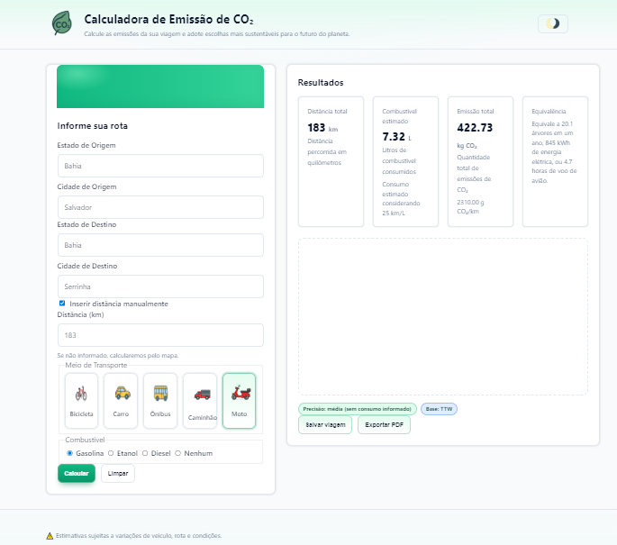


---
## Calc CO₂


---
## 📖 Sobre o Projeto

Este projeto foi desenvolvido como parte de um desafio do **Bootcamp GitHub Copilot - Código na Prática** na DIO.  
O objetivo é calcular as emissões de dióxido de carbono (CO₂) com base em diferentes meios de transporte e combustíveis, permitindo ao usuário visualizar o impacto ambiental de suas escolhas de deslocamento.

---

## 🚀 Funcionalidades

- **Seleção de meio de transporte**
  - Carro, ônibus, caminhão, moto, bicicleta.
  - Interface amigável com ícones representando cada modal.

- **Escolha de combustível**
  - Gasolina, etanol, diesel ou nenhum (para bicicleta).

- **Cálculo de emissões de CO₂**
  - Suporte a **Tank-to-Wheel (TTW)** e **Well-to-Wheel (WTW)**.
  - Exibição clara do resultado em **kg CO₂**.
  - Equivalências ambientais (árvores necessárias, consumo de energia etc.).

- **Entrada de distância**
  - Manual (usuário informa a quilometragem).
  - Automática via **integração com API de mapas**.

- **Tema claro/escuro**
  - Alternância manual via botão.
  - Suporte automático ao `prefers-color-scheme`.
  - Transição suave entre os temas.
  - Persistência da preferência do usuário via `localStorage`.

- **Exportação de resultados**
  - Geração de relatório em **PDF**.

- **Interface responsiva e acessível**
  - Layout adaptado para desktop e mobile.
  - Foco visível e suporte a leitores de tela.

- **Histórico e transparência**
  - Uso de `console.log` para depuração e acompanhamento dos cálculos.
  - Estrutura modular (`utils.js`, `co2-factors.js`, `calculator.js`, `ui.js`).

---

## 🛠️ Tecnologias Utilizadas

 <br>

---
## 📸 Demonstração

Aqui está uma prévia da interface do aplicativo:



---
## 🌐 Acesse o App
[Clique aqui para usar o CO₂ Calculator]([https://seu-link-aqui.vercel.app](https://jfcampos5.github.io/CO2-calculator/))

---

## 📂 Estrutura de Pastas
````
public/
├── assets/
│    ├── img/                # ícones dos modais
│    └── js/
│         ├── utils.js        # funções auxiliares
│         ├── co2-factors.js  # fatores de emissão
│         ├── calculator.js   # lógica de cálculo
│         └── ui.js           # interação com a interface
└── index.html                # página principal
``````
---

## ⚙️ Como Executar


   ```bash
   1. Clone este repositório:

   git clone https://github.com/seu-usuario/calc-co2.git
   
   2.Acesse a pasta do projeto:
      cd calc-co2

   3.Abra o arquivo index.html em seu navegador.

   4.Preencha os campos de origem, destino e selecione o modal de transporte.
   
   5.Clique em Calcular para visualizar as emissões.

````
---
📊 Exemplo de Uso
---
**Origem:** Salvador

**Destino:** São Paulo

**Modal:** Carro (Gasolina)

**Distância:** 1960 km

**Resultado:** ~4527 kg CO₂

---
📈 Próximos Passos
---
- Gráficos comparativos entre diferentes modais. 
- Ajustes visuais adicionais para melhorar a experiência em tema escuro. 
- Otimização da performance e refino da interface.

---
👩‍💻 Autora
---
Projeto desenvolvido por Joelma Campos, como parte do desafio da Digital Innovation One (DIO).

---
📜 Licença
---
Este projeto está sob a licença MIT.
Sinta-se livre para usar, modificar e compartilhar.

4. Abra no navegador:
   http://localhost:3000

